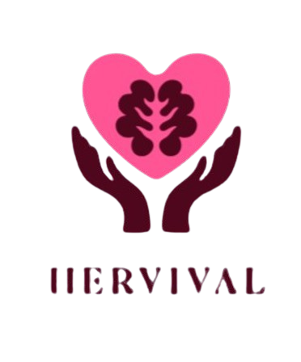

# HerVival - Emotional Support AI Assistant



## Overview

HerVival is an emotion-aware AI chatbot designed to provide emotional support, crisis detection, and mental health resources. The application uses advanced natural language processing to detect emotional states and potential crisis situations, offering appropriate responses and connecting users with professional resources when needed.

## Features

### 🧠 Emotion-Aware Conversations

- Real-time emotion detection and analysis
- Personalized responses based on emotional state
- Confidence-based response adjustment

### 🚨 Crisis Detection & Support

- Advanced pattern matching for crisis keywords
- Multi-level severity assessment (1-5 scale)
- Automatic emergency resource provision
- Support for various crisis types:
  - Suicide ideation
  - Self-harm
  - Abuse and harassment
  - General emotional distress

### 💬 Interactive Chat Interface

- Clean, responsive web interface
- Real-time message processing
- User session management
- Mobile-friendly design

### 🏥 Resource Integration

- Emergency hotlines and services
- Professional counselor directory
- Crisis support resources
- Local mental health services

## Technology Stack

- **Backend**: Flask (Python)
- **Frontend**: HTML5, CSS3, JavaScript
- **AI/ML**: Transformers, PyTorch, NLTK
- **Dependencies**: See `requirements.txt`

## Installation

### Prerequisites

- Python 3.8 or higher
- pip package manager

### Setup Instructions

1. **Clone the repository**

   ```bash
   git clone <repository-url>
   cd "Emo AI"
   ```

2. **Create a virtual environment**

   ```bash
   python -m venv venv
   venv\Scripts\activate  # On Windows
   # source venv/bin/activate  # On macOS/Linux
   ```

3. **Install dependencies**

   ```bash
   pip install -r requirements.txt
   ```

4. **Set up environment variables**

   Create a `.env` file in the root directory:

   ```env
   FLASK_SECRET_KEY=your-secret-key-here
   FLASK_ENV=development
   ```

5. **Run the application**

   ```bash
   python app.py
   ```

6. **Access the application**

   Open your web browser and navigate to `http://localhost:5000`

## Project Structure

```text
Emo AI/
│
├── app.py                    # Main Flask application
├── conversation_handler.py   # Core conversation logic and emotion handling
├── crisis_support.py        # Crisis detection and support systems
├── requirements.txt          # Python dependencies
├── temp_firebase_config.json # Firebase configuration (if applicable)
├── .env                     # Environment variables (create this)
│
├── static/
│   └── images/
│       ├── logo.png         # Application logo
│       └── jpg2png/         # Image assets
│
├── templates/
│   ├── index.html           # Main chat interface
│   ├── auth.html            # Authentication page
│   ├── counselors.html      # Professional counselors directory
│   ├── services.html        # Emergency services page
│   └── 404.html             # Error page
│
└── __pycache__/             # Python cache files
```

## Key Components

### ConversationHandler

- Manages emotion-aware conversations
- Processes user inputs with context awareness
- Generates appropriate responses based on emotional state
- Maintains conversation flow and context

### CrisisDetector

- Analyzes text for crisis indicators using regex patterns
- Assigns severity levels (1-5 scale)
- Triggers appropriate intervention responses
- Provides immediate resource recommendations

### Flask Routes

- `/` - Main chat interface (requires authentication)
- `/login` - User authentication
- `/chat` - API endpoint for message processing
- `/counselors` - Professional resources
- `/services` - Emergency services
- `/user/activity` - Activity tracking

## Configuration

### Environment Variables

- `FLASK_SECRET_KEY`: Secret key for session management
- `FLASK_ENV`: Application environment (development/production)

### Crisis Detection Patterns

The system detects various crisis keywords and phrases:

- **Level 5 (Critical)**: Suicide ideation, self-harm
- **Level 4 (High)**: Safety concerns, abuse, harassment
- **Level 3 (Medium)**: Hopelessness, inability to cope

## Usage

1. **Start a Conversation**: Navigate to the main page and begin chatting
2. **Emotional Support**: The AI will detect your emotional state and respond appropriately
3. **Crisis Support**: If crisis indicators are detected, immediate resources will be provided
4. **Professional Help**: Access counselor directory and emergency services as needed

## Safety Features

- **Immediate Crisis Response**: Automatic detection and response to crisis situations
- **Professional Resource Integration**: Direct links to emergency services and counselors
- **Privacy Protection**: Secure session management and data handling
- **Error Handling**: Graceful degradation with supportive error messages

## Contributing

1. Fork the repository
2. Create a feature branch (`git checkout -b feature/new-feature`)
3. Commit your changes (`git commit -am 'Add new feature'`)
4. Push to the branch (`git push origin feature/new-feature`)
5. Create a Pull Request

## Important Notes

⚠️ **Disclaimer**: This application is designed to provide emotional support and crisis resource information. It is not a replacement for professional mental health services, emergency services, or medical treatment.

🆘 **Emergency**: If you or someone you know is in immediate danger, please contact your local emergency services (911 in the US) or a crisis hotline immediately.

## License

This project is developed for educational purposes as part of a BTech college project.

## Support

For technical support or questions about this project, please contact the development team.

---

**Remember**: Your mental health matters. This tool is here to support you, but professional help is always available when you need it.
